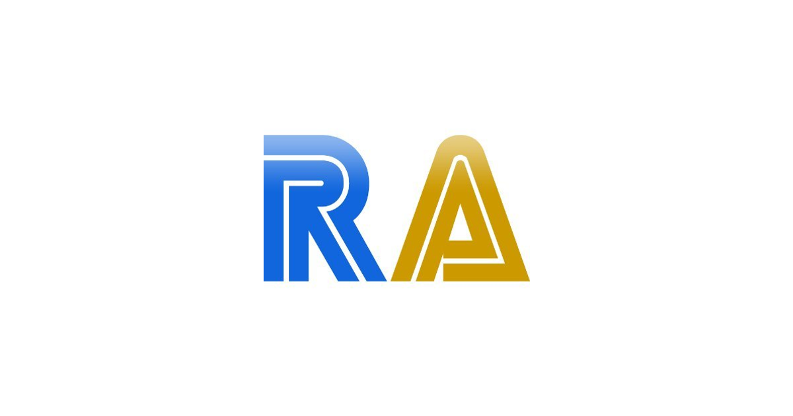

# RetroAchievements for Home Assistant



This integration allows you to monitor your RetroAchievements stats and progress in Home Assistant.

## Installation

### HACS (Recommended)
1. Make sure you have [HACS](https://hacs.xyz/) installed.
2. Go to HACS > Integrations > Click the three dots in the top right > Custom repositories.
3. Add this repository URL with category "Integration".
4. Click "Install" on the RetroAchievements integration.
5. Restart Home Assistant.

### Manual Installation
1. Copy the `custom_components/retroarchievements` folder to your Home Assistant's `custom_components` folder.
2. Restart Home Assistant.

## Setup

1. Go to Settings > Devices & Services > Add Integration
2. Search for "RetroAchievements"
3. Enter your RetroAchievements username and API key

## API Key
You can find your RetroAchievements API key in your account settings on the [RetroAchievements website](https://retroachievements.org/).

## Entities

The integration provides the following entities:

### User Profile Sensors

| Sensor | Description | Attributes |
|--------|-------------|------------|
| `sensor.retroachievements_USERNAME_points` | Total points earned across all games | Profile details including ID, member since date, profile URL, profile picture |
| `sensor.retroachievements_USERNAME_true_points` | Total true points (weighted score) | Same as above |
| `sensor.retroachievements_USERNAME_rank` | Global rank on RetroAchievements | Same as above |
| `sensor.retroachievements_USERNAME_status` | Account status (Online/Offline) | Same as above |
| `sensor.retroachievements_USERNAME_rich_presence` | Current gaming activity status | Same as above |
| `sensor.retroachievements_USERNAME_games_count` | Number of games played | Same as above |
| `sensor.retroachievements_USERNAME_completed_games_count` | Number of games completed | Same as above |
| `sensor.retroachievements_USERNAME_completion_percentage` | Overall completion percentage | Same as above |
| `sensor.retroachievements_USERNAME_achievements_unlocked` | Number of achievements unlocked | Same as above |
| `sensor.retroachievements_USERNAME_recent_achievements` | Count of recently unlocked achievements | List of recently unlocked achievements with details |

### Game-specific Sensors

For each recently played game, the integration creates:

| Sensor | Description | Attributes |
|--------|-------------|------------|
| `sensor.retroachievements_game_GAME_ID` | Completion percentage for the game | Game details including ID, console, achievements (total/earned), points (total/earned), last played date, game images, and recently unlocked achievements |

All game sensors are grouped under your RetroAchievements user device for easy organization.

## Attributes

### User Profile Attributes
- `user_id`: Your RetroAchievements user ID
- `username`: Your RetroAchievements username
- `display_name`: Your display name on RetroAchievements
- `member_since`: Date you joined RetroAchievements
- `profile_url`: Link to your RetroAchievements profile
- `profile_image`: URL to your profile picture
- `last_update`: Timestamp of the last data update

### Recent Achievements Attributes
- `recent_achievements`: List of recently unlocked achievements containing:
  - `achievement_id`: Achievement ID
  - `title`: Achievement name
  - `description`: Achievement description
  - `points`: Points value
  - `badge_url`: URL to the achievement badge
  - `game_id`: ID of the game
  - `game_title`: Title of the game
  - `console_name`: Console name
  - `unlocked_date`: When the achievement was unlocked

### Game Sensor Attributes
- `game_id`: RetroAchievements game ID
- `game_title`: Game name
- `console_name`: Console name
- `console_id`: Console ID
- `developer`: Game developer name (if available)
- `publisher`: Game publisher name (if available)
- `genre`: Game genre (if available)
- `release_date`: Game release date (if available)
- `last_played`: Last played timestamp
- `image_icon`: Game icon URL
- `image_box_art`: Game box art URL
- `image_title`: Game title screen image URL
- `image_ingame`: In-game screenshot URL
- `achievements_total`: Total number of achievements
- `achievements_earned`: Number of earned achievements
- `points_total`: Total possible points
- `points_earned`: Points earned
- `completion_percentage`: Game completion percentage
- `recent_achievements`: List of recently unlocked achievements for this game

## Use Cases

- Create a dashboard to track your gaming progress
- Set up automations based on achievement unlocks
- Monitor your RetroAchievements rank and statistics
- Track completion percentages across your game collection
- Display recently unlocked achievements in your dashboard

## Troubleshooting

If you encounter issues, please:
1. Enable debug logging for the component in your `configuration.yaml`:
   ```yaml
   logger:
     default: info
     logs:
       custom_components.retroarchievements: debug
   ```
2. Check the logs for error messages
3. Open an issue on GitHub with the logs and steps to reproduce

## Contributing
Contributions are welcome! Please feel free to submit a Pull Request.
